

  

  Modular Embedded Operating System 
  Core • Web OS • HAL • Dynamic Modules

---

## 🔍 What is LoopMax

**LoopMax Embedded OS** is a modular framework for embedded systems designed
to provide a **shared core**, independent from hardware and framework,
on top of which complete devices can be built using
**dynamically loaded application modules**.

LoopMax includes a **Web-Based Operating System** and all essential system services,
allowing developers to focus only on application logic.

---

# 🚀 Try it
Access the flasher tool directly from your browser:
**https://smartilab.it/tools/**

---

## 🚀 Why LoopMax

Because enough with:

- scattered projects
- duplicated base code
- reinvented web interfaces
- repeated system services on every device

With LoopMax:

- you develop **only your module**
- the **core** is already available
- the **Web OS** is integrated
- the infrastructure is shared
- the device is immediately operational

👉 One system  
👉 One core  
👉 Infinite devices  
👉 Same professional UI Bootstap.

---

## 🧩 Architecture (overview)

LoopMax is structured in multiple layers:

- **LoopMax Core**
  - Web-Based OS
  - System services
  - Module management
- **HAL (Hardware Abstraction Layer)**
  - Multi-framework support (Arduino / ESP-IDF)
  - Multi-board support
- **Application Modules**
  - Zappy2 (included in the project as an example)
  
  - Extensible over time

---
## 🚀 HAL (Hardware Abstraction Layer)
## Service Manager Architecture

Each Service Manager extends three interfaces:

- **`IService`**  
  Used by the core to manage the service lifecycle.

- **`IHal_XxxxManager`**  
  Core manager interface, with a base class that varies depending on the underlying hardware.

- **`IXxxx`**  
  Public interface exposed to external application modules and implemented by the various service managers.

Below is an example of the structure of a single service:

  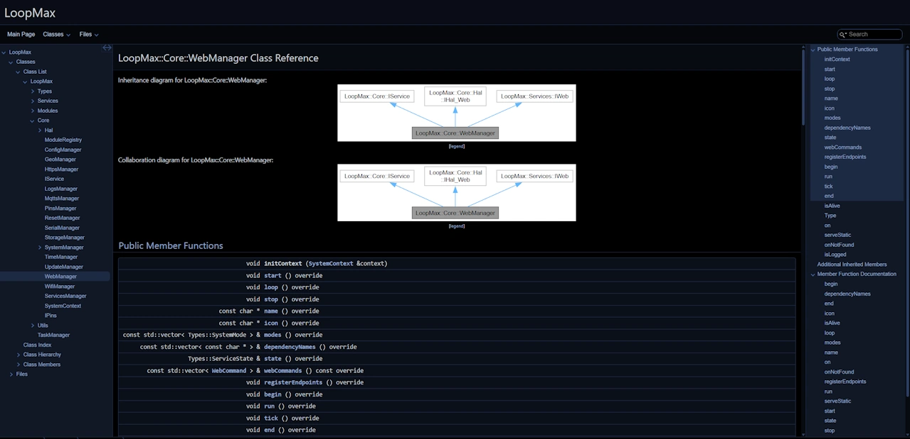

---
## Zappy 2ch Module

  

The **LoopMax** project includes the **Zappy 2ch** module, an application module designed to control a **two-channel relay board**.
The application module interfaces directly with the dual-relay hardware, allowing remote control of connected loads through the LoopMax system.
A **Bootstrap-based user interface** is included and **dynamically loaded by the LoopMax core**, providing a simple and responsive web interface for controlling the relays without requiring additional frontend configuration.

### 🔌 GPIO Pin Assignment
The Zappy 2ch module uses the following GPIO pins:
| GPIO  | Function | Description |
|------:|----------|-------------|
| GPIO 4  | Reset | At power-on, keep the button pressed for **10 seconds** to reset the device and enable web-based setup |
| GPIO 22 | Relay 1 | Controls Relay Channel 1 |
| GPIO 23 | Relay 2 | Controls Relay Channel 2 |

### ℹ️ Reset Behavior
The reset function can be triggered in the following ways:
- **At startup** by keeping the reset button pressed while powering on the device
- **While the board is powered on** by holding the reset button for **10 seconds**
- **From the web interface** using the dedicated reset button available in the LoopMax portal

### ℹ️ Notes
- The web interface is automatically managed by the LoopMax core
- Designed for ESP32-based boards

---

## Circuit

  

---

## 🧱 3D Printed Enclosure

A custom **3D-printable enclosure** is available for the Zappy 2ch module.

The enclosure is designed to properly fit the electronics, provide safe cable routing, and allow easy access to buttons and connectors.

👉 **Download the 3D model here:**  
https://makerworld.com/en/models/2308490-zappy-2-lines#profileId-2520051

### 🖨️ Printing Notes
- Optimized for FDM printing
- Recommended material: PLA or PETG

---

## 🧩 Web UI (Bootstrap)

<h5 align="center">Relè module (2ch)</h5>

  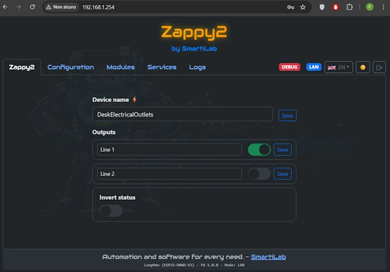

<h5 align="center">Device configuration</h5>

  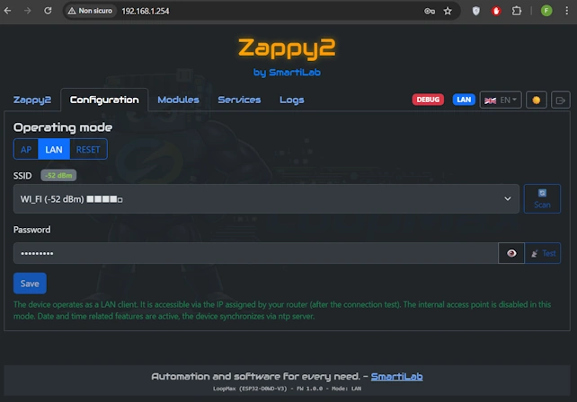

<h5 align="center">Application Modules</h5>

  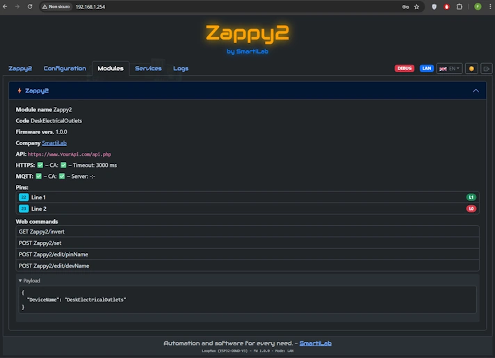

<h5 align="center">Device services</h5>

  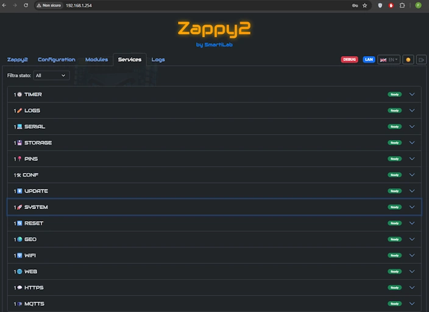

<h5 align="center">Service: System</h5>

  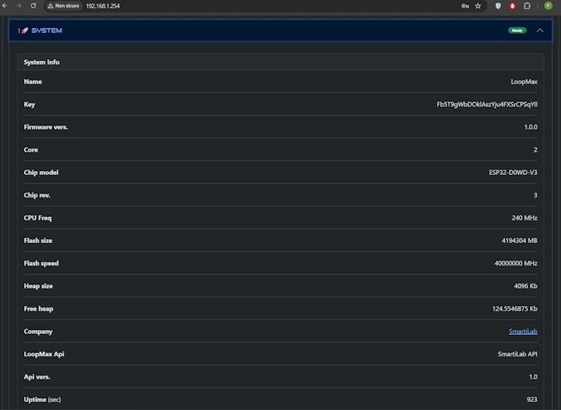

<h5 align="center">Service: Wifi</h5>

  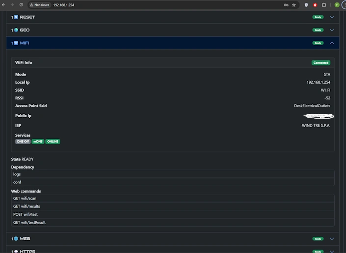

<h5 align="center">Service: Web</h5>

  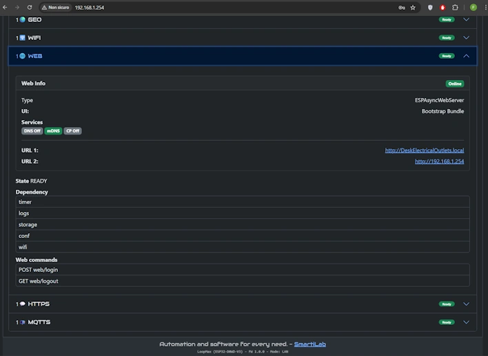

<h5 align="center">Boot timeline</h5>

  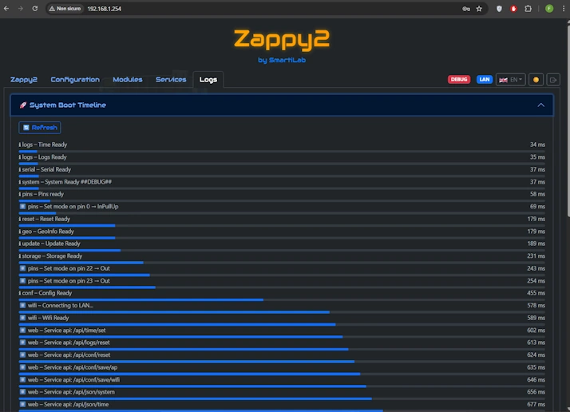

<h5 align="center">Events timeline</h5>

  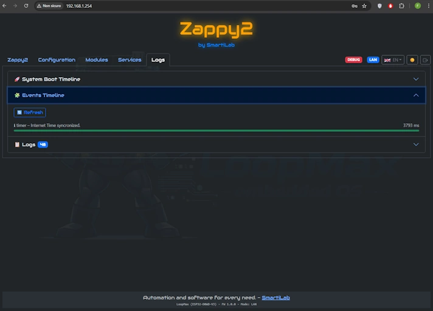

<h5 align="center">System Logs</h5>

  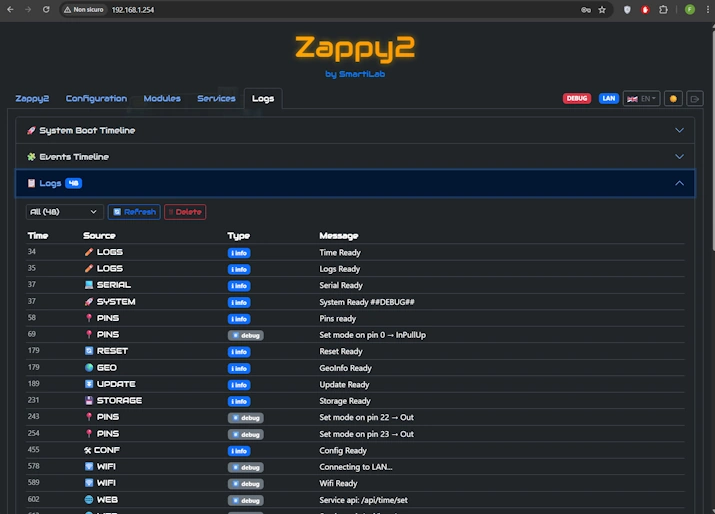

---

## 🧠 Philosophy

LoopMax was created to eliminate embedded project fragmentation
and maximize code reuse.

Every new feature is a **module**,
not a new project from scratch.

---

## 📦 Release Information

| LoopMax OS |       |
|------------|-------|
| Version    | **1.0.0** |
| Status     | Stable |
| Updates    | Continuous |

---

## 🧩 Currently Supported Boards  
*(continuously updated)*

| Framework | Board         | Core |
|----------|--------------|------|
| Arduino  | ESP32-WROOM  | 2    |

---

## ⚠️ License

This project is available **for personal, non-commercial use only**.  
See the `LICENSE` file for full terms.

---

## 🚧 Project Status

The project is under active development.  
Technical documentation will be expanded progressively.

# 🚀 LoopMax Flasher Tools

## 🔗 Tool Link (Web Serial)
Access the flasher tool directly from your browser:

**https://smartilab.it/tools/**

---

## 🔧 Features
- Flash firmware directly from the browser (Web Serial)
- Supports ESP32 and ESP8266
- Baudrate selection
- Built-in Serial Monitor
- Automatic upload of firmware + filesystem (LittleFS)
- No external software required

---

## 📌 How to Use

### 1️⃣ Open the tool
Go to: **https://smartilab.it/tools/**

### 2️⃣ Connect the board
- Select the COM port
- Set the baud rate (e.g. **115200**)
- Click **Flash**

### 3️⃣ Done!
The board will be programmed and will start automatically.

---

## 🧰 Requirements
- Browser with **Web Serial** support (Chrome / Edge)
- ESP32 connected via USB

---

